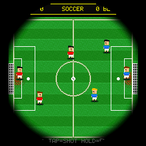
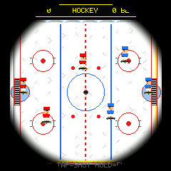
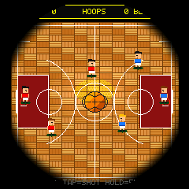
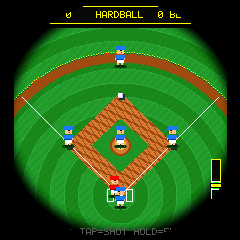

# Kunio-kun Multi-Sport Championship (ESP32-C3)

Retro 1990 Game Boy / Kunio-kun / Super Famicom style multi-sport simulation running on the **ESP32-2424S012** (1.28\" 240x240 circular IPS GC9A01 display).

   
 

## Features
- **4 Autonomous Sports:**
  - **Soccer:** 3-on-3 with diving goalkeepers, diagonal crossing runs, slide tackles, and cannon shots.
  - **Ice Hockey:** Gliding skaters, puck physics, two-handed stick checking, and slap shots on a brilliant white sheet of ice.
  - **Basketball:** Hardwood parquet court, crossover dribbles, fast-break passing, and airborne slam dunks.
  - **Baseball:** True diamond layout, down-to-plate pitching, and 1-button sweet-spot hitting gauge for towering home runs.
- **Single-Button Controls (BOOT Pin / GPIO 9):**
  - **Short Tap (<300ms):** Super shot, slam dunk, or swing timing.
  - **Long Press (>=300ms):** Dynamic wall evasion (evades UP or DOWN towards the further wall).
- **RST Sport Memory:** Automatically cycles to the next sport on reset (`Soccer -> Hockey -> Hoops -> Hardball`) using non-volatile flash storage (`Preferences`).
- **Power Management:** Automatically enters deep sleep with LCD and backlight powered down after 2 minutes of inactivity. Press `BOOT` or `RST` to wake.
- **Visuals:** 16-bit multi-tone shaded Kunio-kun sprites, dynamic body lean, 3-tone grass/ice/wood surfaces, and perimeter vignette.

## Hardware
- **Board:** ESP32-2424S012 (ESP32-C3 rev 0.4, 4MB Flash, USB-CDC)
- **Display:** GC9A01 240x240 Circular IPS LCD (SPI, LovyanGFX)
- **Controls:** BOOT button (GPIO 9, active LOW), RST button (hardware reset)

## Building & Flashing
```bash
# Build
uvx platformio run

# Flash to device
uvx platformio run -t upload
```
